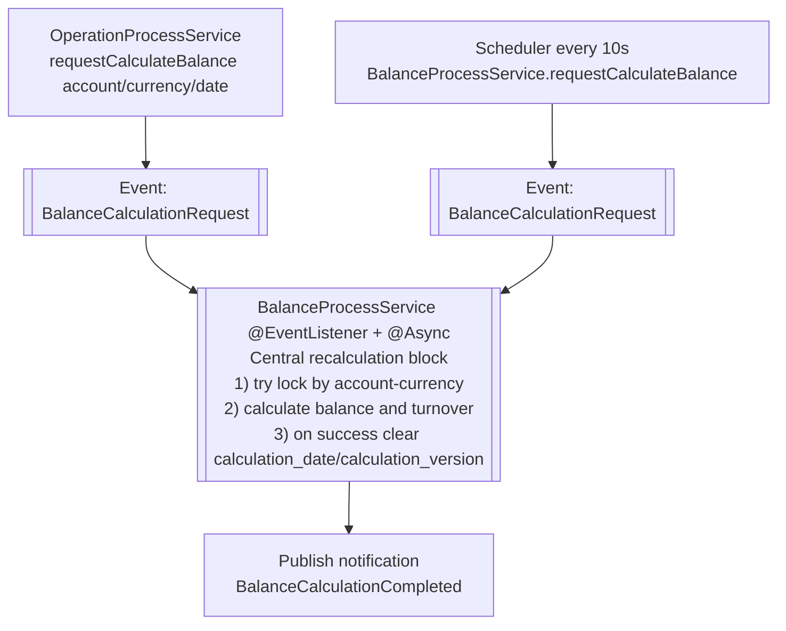

# Balance recalculation diagram

This file contains a visual representation of the balance recalculation flow.

Out of scope: ImportData totals recalculation (`ImportDataProcessService.calculateTotal` and related events).

## Simplified diagram

## Legend

- Central recalculation block is always asynchronous (`@Async`).
- Both incoming paths enter the central block via `BalanceCalculationRequest` events.
- `BalanceCalculationCompleted` is sent after successful processing in the central block.

